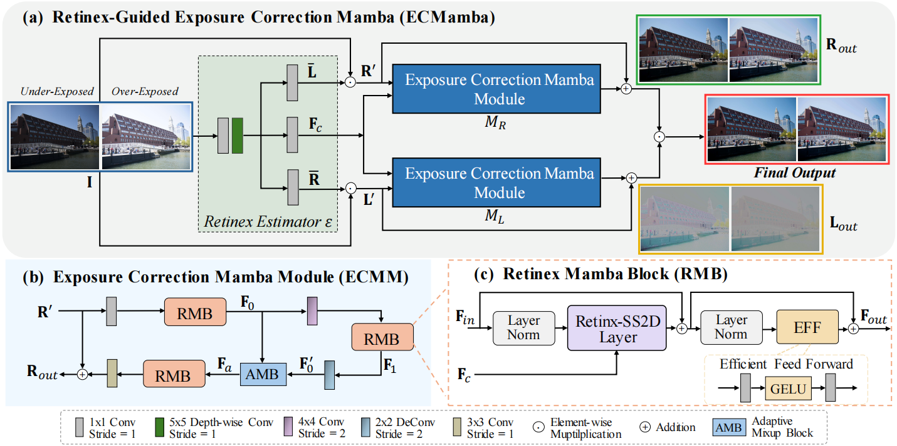

#  [NeurIPS 2024] ECMamba: Consolidating Selective State Space Model with Retinex Guidance for Efficient Multiple Exposure Correction

<h4 align="center">Wei Dong1,*, Han Zhou1,*, Yulun Zhang2, Xiaohong Liu2,&dagger;, Jun Chen1

<h4 align="center">1McMaster University, 2Shanghai Jiao Tong University, 
<h4 align="center">*Equal Contribution, &dagger;Corresponding Author

  
### Introduction
This repository represents the official implementation of our NeurIPS 2024 paper titled **ECMamba: Consolidating Selective State Space Model with Retinex Guidance for Efficient Multiple Exposure Correction**. Pre-print paper and code will be released soon. Thank you for your interest.

### Overall Framework

