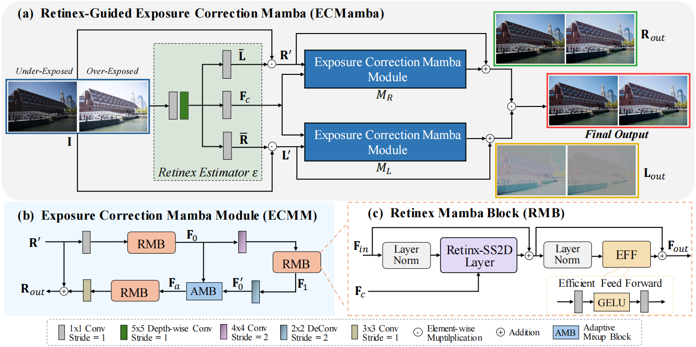

#  [NeurIPS 2024] ECMamba: Consolidating Selective State Space Model with Retinex Guidance for Efficient Multiple Exposure Correction

<h4 align="center">Wei Dong<sup>1,*</sup>, Han Zhou<sup>1,*</sup>, Yulun Zhang<sup>2</sup>, Xiaohong Liu<sup>2,&dagger;</sup>, Jun Chen<sup>1</sup></center>
<h4 align="center"><sup>1</sup>McMaster University, <sup>2</sup>Shanghai Jiao Tong University, 
<h4 align="center"><sup>*</sup>Equal Contribution, <sup>&dagger;</sup>Corresponding Author</center></center>
  
### Introduction
This repository represents the official implementation of our NeurIPS 2024 paper titled **ECMamba: Consolidating Selective State Space Model with Retinex Guidance for Efficient Multiple Exposure Correction**. If you find this repo useful, please give it a star ⭐ and consider citing our paper in your research. Thank you for your interest. 

[](https://www.apache.org/licenses/LICENSE-2.0)

We present ECMamba, the first mamba-based framework for multiple exposure correction and low-light image enhancement.

- **Mamba-based Multiple Exposure Correction**: exploit mamba-based framework to process images with adverse illumination with high efficiency.
- **Dual-path Retinex-guided Restoration Framework**: develop a dual-path Retinex-guided restoration pipeline by introducing two intermediary spaces based on Retinex theory.
- **Feature-aware Scanning Strategy**: Different from direction-sensitive scanning method, we design a feature-aware 2D selective scanning mechanism to transform 2D iamge or feature maps into 1D sequences. 

## 📢 News
**2025-06-03** This repo has been updated. Pre-trained weights and test codes are released!

### Overall Framework



## 🛠️ Setup

The inference code was tested on:

- Python 3.9, CUDA 11.7, PyTorch 2.0.1 + cu117.

### 📦 Repository

Clone the repository (requires git):

```bash
git clone https://github.com/LowLevelAI/ECMamba.git
cd ECMamba
```

### 💻 Dependencies

- **Make Conda Environment: Using [Conda](https://conda.io/projects/conda/en/latest/user-guide/tasks/manage-environments.html) to create the environment:** 

    ```bash
    conda create -n ecmamba python=3.9
    conda activate ecmamba
    ```
- **Then install dependencies:**
  - Install Pytorch

  ```bash
  conda install pytorch==2.0.1 torchvision==0.15.2 torchaudio==2.0.2 pytorch-cuda=11.7 -c pytorch -c nvidia
  ```
  - Install `mamba_ssm` library
  ```bash
  pip install causal_conv1d==1.0.0
  pip install mamba_ssm==1.0.1
  ```
  - Install `DCNv4` library
  ```bash
  pip install -U openmim
  mim install mmcv-full
  pip install timm mmdet
  pip install opencv-python termcolor yacs pyyaml scipy
  pip install DCNv4
  ```
  - Install other dependencies
  ```bash
  pip install numpy==1.26.4 transformers==4.48.2 opencv-python natsort scikit-image timm matplotlib
  ```

- **Revise `DCNv4` CUDA extensions:**
  In `/anaconda3/envs/ecmamba/lib/python3.9/site-packages/DCNv4/modules/dcnv4.py` line 153, replace `retunr x` with **`retune x, offset_mask`**.


## 🏃 Testing on benchmark datasets

### 📷 Download following datasets:

- MEDataset (Please refer to [Learning Multi-Scale Photo Exposure Correction](https://github.com/mahmoudnafifi/Exposure_Correction))
  
- SICE Dataset [Drive](https://drive.google.com/file/d/1L-kqSQyrmMueBh_ziWoPFhfsAh50h20H/view?usp=sharing)
  
- LOLv1 [Google Drive](https://drive.google.com/file/d/1L-kqSQyrmMueBh_ziWoPFhfsAh50h20H/view?usp=sharing)


### ⬇ Download pre-trained models

Download [Pre-trained weights for SICE Dataset](https://drive.google.com/drive/folders/1Cesn3jJAdxjT7DDZCTMU8Vt2CnauBL7F?usp=drive_link), and [Pre-trained weights for LOLv1](https://mcmasteru365-my.sharepoint.com/:u:/g/personal/dongw22_mcmaster_ca/Ee1tHtVFsWJDhpejI1sWY-MBTvbQGg2lBY00rWGTKg37jQ?e=KaSA1E). Place them to folder `weights`. 

### 🚀 Run inference
- For SICE dataset

```bash
python test_sice.py
```

- For LOLv1 dataset

```bash
python test_lol.py
```

You can find all results in `test-results/`. **Enjoy**!


### 🏋️ Model Outputs
For your convenience, we also provide our outputs here.
- LOLv1: [With GT-mean](https://mcmasteru365-my.sharepoint.com/:f:/g/personal/dongw22_mcmaster_ca/Egphs1uU_DNJphgOJgx-33MB1JLnmls4sTt13Vg5jjSh-w?e=RG2dg2), [Without GT-mean](https://mcmasteru365-my.sharepoint.com/:f:/g/personal/dongw22_mcmaster_ca/ElRpMbjB32JOvBrW33vvWP0BcqRvUNk2RZCXQflyxKXtEg?e=NSlOTG)
